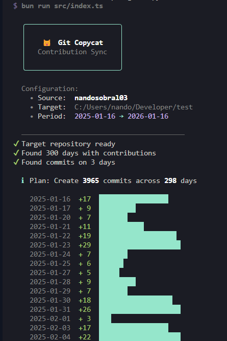

# Git Copycat

A CLI tool that mirrors your GitHub contribution history from a work or secondary account to your main account by creating backdated commits.

Useful when you want your primary GitHub profile to reflect contributions made on other accounts (e.g., work, freelance, or school).




## How It Works

1. Fetches the contribution calendar from the source GitHub account
2. Analyzes existing commits in your target repository
3. Creates empty backdated commits to match the source contribution count

The tool is **idempotent** you can run it multiple times safely. It only creates the commits needed to match the source, skipping dates that already have enough commits.

Commits look like this:
```
Contribution sync: 2024-01-15 (1/3)
Contribution sync: 2024-01-15 (2/3)
Contribution sync: 2024-01-15 (3/3)
```


## Installation

**Prerequisites:**
- [Bun](https://bun.sh) runtime installed
- GitHub personal access token with `read:user` scope (for accessing contribution data via GraphQL API)

```bash
git clone https://github.com/nandosobral03/git-copycat
cd git-copycat
bun install
```

## Setup

1. **Create a target repository** on GitHub where the mirrored commits will live
2. Clone it locally or initialize a new repo and add the remote
3. Copy the example environment file and fill in your values:

```bash
cp .env.example .env
```

## Configuration

Edit `.env` with your configuration:

| Variable | Required | Description |
|----------|----------|-------------|
| `GITHUB_TOKEN` | Yes | Any GitHub personal access token (needs `read:user` scope) |
| `SOURCE_USERNAME` | Yes | GitHub username to copy contributions from (must have public contributions visible) |
| `TARGET_REPO_PATH` | Yes | Path to local target repository |
| `FROM_DATE` | No | Start date (ISO format, default: 1 year ago) |
| `TO_DATE` | No | End date (ISO format, default: today) |
| `DRY_RUN` | No | Set to `true` to preview without creating commits |
| `AUTO_PUSH` | No | Set to `true` to automatically push commits |

## Usage

```bash
bun run start
```

## Important: Making Contributions Appear

For commits to show up on your GitHub contribution graph, **all** of these must be true:

1. **Email must match** - Your local git email (`git config user.email`) must be [linked to your GitHub account](https://github.com/settings/emails).
2. **Enable private contributions on your git contribution graph.** (If the TARGET_REPO_PATH is private, also remember to turn this on on your target account if commits are on private repos)
3. **Commits must be on the default branch** - Usually `main` or `master`.
4. **Repo cannot be a fork** - Commits in forks don't count unless merged upstream.

Run `DRY_RUN=true` first to preview what will be created.

## Undo / Cleanup

If you need to remove the generated commits:

```bash
# Find the commit hash before the sync started
git log --oneline

# Reset to that commit (destructive - loses all commits after)
git reset --hard <commit-hash>

# Force push to update remote
git push --force
```

Or just delete the target repository entirely if it was created only for this purpose.

## Disclaimer

GitHub contribution graphs have always been trivial to fake this tool doesn't change that. The graph works on an honor system; it's a rough signal, not a verified credential. This tool is intended for consolidating your own legitimate work across accounts, not for misrepresenting your activity. Use your own judgment.
